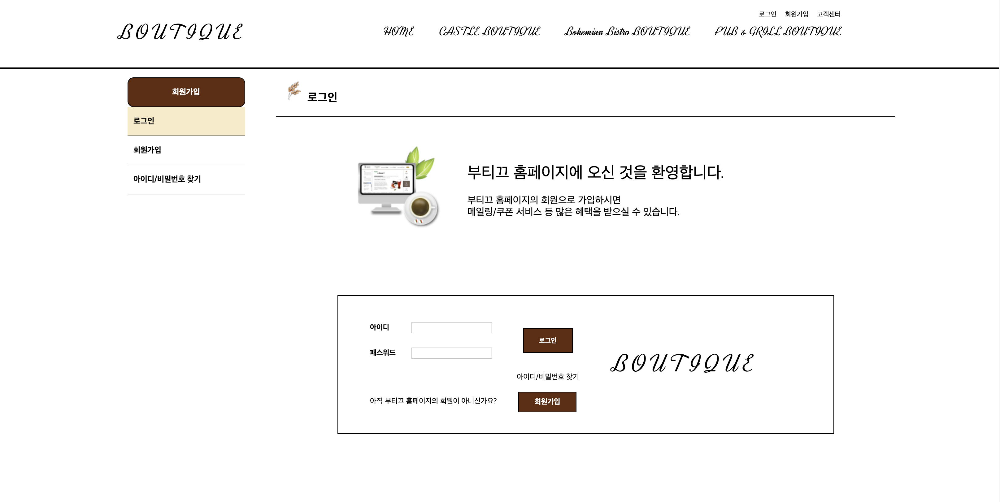

# 3학년 2학기 웹프로젝트 (레스토랑 소개 사이트)
### 1. index

  
 

### 2. Menu List
- castle boutigue

  
- bohemian bistro boutique

  
- pub & grill boutique

  
 

### 3. Brand Story

  
 

### 4. Czech Beer International

  
 

### 5. Faq

  
 

### 6. Login

  
 

### 7. Apply

- 이용약관

- 개인정보취급방침

  
 

### 8. Search Id & PW

